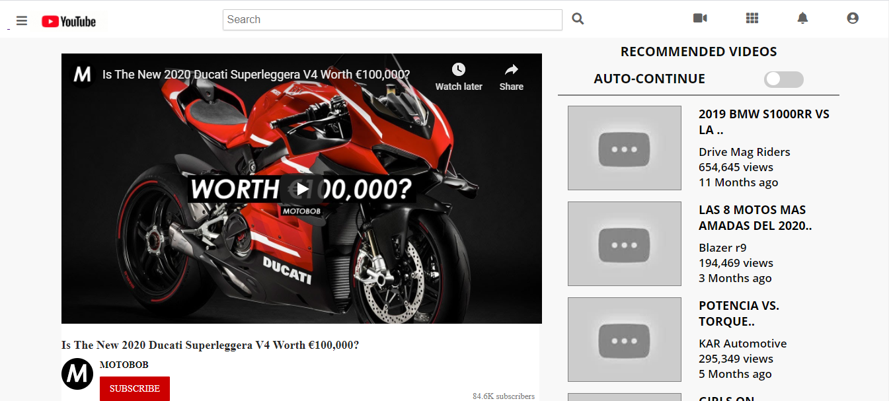

# Youtube-page
This project consists of building an HTML and CSS document that matches the appearance of the youtube video player webpage.
the main objective of this project is to get the knowledge of how positioned the elements for web pages in this case a version youtube page.

## Built With

- [HTML](https://developer.mozilla.org/en-US/docs/Web/HTML),
- [CSS](https://www.w3schools.com/css/),
- [Fontawesome](https://fontawesome.com/),
- [GitHub](https://github.com/),

## Live Demo

[Live Demo Link](https://rawcdn.githack.com/Fanger53/youtube-clone/ed85b30ced21582d0d6b30b6c64414bec004b44e/index.html)

## Authors

👤 Brian Sammit Cruz Rodriguez

Github: @BrianSammit https://github.com/BrianSammit

Twitter: @CruzSammit https://twitter.com/CruzSammit

Linkedin: https://www.linkedin.com/in/brian-sammit-cruz-rodriguez-5877551a8/

👤 Author2

Github: @Fanger53

Twitter: @DavidLe97005129

Linkedin: https://www.linkedin.com/in/david-castillo-61ba10b8/

## 🤝 Contributing

Contributions, issues and feature requests are welcome!

## Show your support

Give a ⭐️ if you like this project!

## Acknowledgments

- Microverse
- W3schools
- Freecodecamp
- Developer.mozilla
- Learnshayhowe
- Odin project

## 📝 License

NO license: This project is free for anyone to use.
